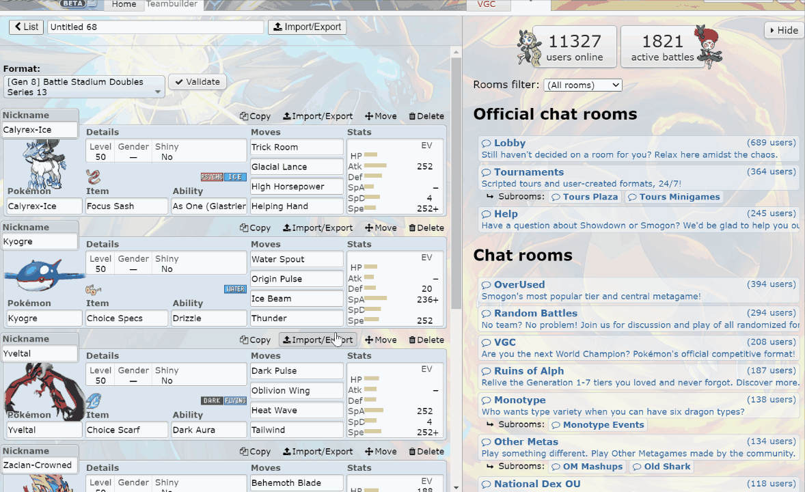
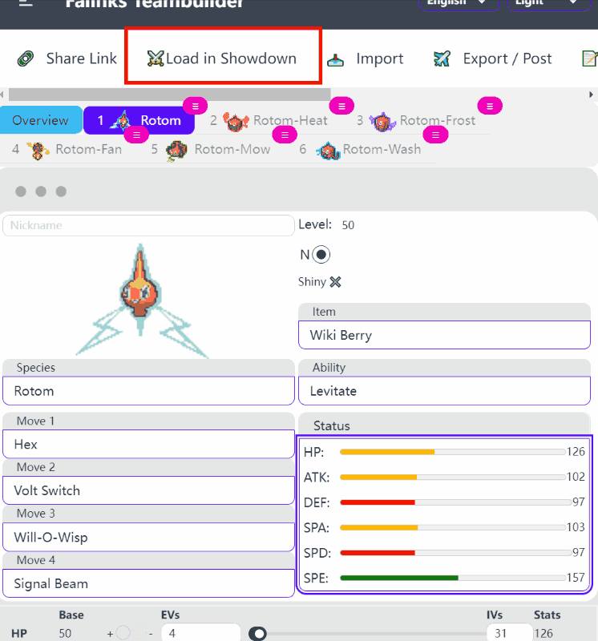
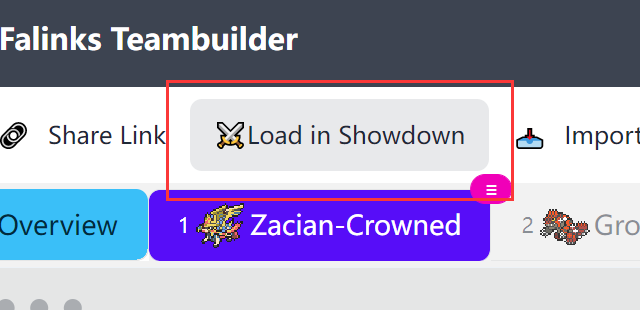
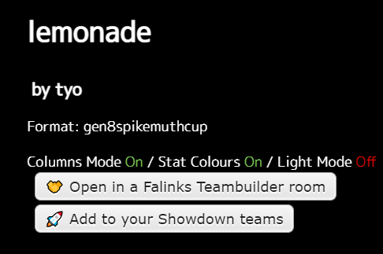

# Falinks teambuilder helper

## Script link: https://greasyfork.org/zh-CN/scripts/451746-falinks-teambuilder-helper




## Introduction

A UserScript helps import teams to a Falinks Teambuilder room. It will be activated on both Pokemon Showdown and PokePaste.

### Import a team from PokePaste/Showdown to a Falinks Teambuilder room

Essentially, it creates a "Open in a Falinks Teambuilder room" button on the page. It makes loading the team into [a collaborative teambuilder](https://www.falinks-teambuilder.com/) easier.

- Pokemon Showdown: On a team list view in Showdown Teambuilder, the button shows at the bottom, next to "Upload to PokePaste" button.
- PokePaste: the button shows at the bottom of the right side.


### Load a team from the Falinks Teambuilder room to Showdown

Once you have finished building your team, you can add it to your Pokémon Showdown by clicking the "Load in Showdown" button in the room. It will automatically add your new team in your Showdown teambuilder storage after your confirmation.



### Load a team from PokePaste/Falinks Teambuilder room to Showdown



## Acknowledgment

Derived from the template [webpack-userscript-template](https://github.com/Trim21/webpack-userscript-template).

## dev

[中文说明](./readme.cn.md)

1. Allow Tampermonkey's access to local file URIs [tampermonkey/faq](https://tampermonkey.net/faq.php?ext=dhdg#Q204)
2. install deps with `npm i` or `npm ci`.
3. `npm run dev` to start your development.

Now you will see 2 files in `./dist/`

- `dist/index.dev.user.js`: **You should install this userscript in your browser.** It's a simple loader that load `dist/index.debug.user.js` on matched web page.
- `dist/index.debug.user.js`: This is the development build with `eval-source-map`. It will be automatically loaded by `dist/index.dev.user.js` via `@require file://.../dist/index.debug.user.js` metadata, **Don't add it to your userscript manager.**

4. edit [src/index.ts](./src/index.ts), you can even import css or less files. You can use scss if you like.
5. go wo [https://www.example.com/](https://www.example.com/) and open console, you'll see it's working.

livereload is default enabled, use [this Chrome extension](https://chrome.google.com/webstore/detail/jnihajbhpnppcggbcgedagnkighmdlei)

### NOTICE

Everytime you change your metadata config,
you'll have to restart webpack server and install newly generated `dist/index.dev.user.js` UserScript in your browser again.

## Cross Site Request

you can call `GM.xmlHttpRequest`,

if you prefer `fetch` API, you can use [https://github.com/Trim21/gm-fetch](https://github.com/Trim21/gm-fetch)

If you are using axios, you can use [https://github.com/Trim21/axios-userscript-adapter](https://github.com/Trim21/axios-userscript-adapter)

(these libraries are both included already)

## TypeScript

use typescript as normal, see [example](src/index.ts)

## dependencies

There are two ways to using a package on npm.

### UserScript way

like original UserScript way, you will need to add them to your [user script metadata&#39;s require section](./config/metadata.cjs#L13-L17) , and exclude them in [config/webpack.config.base.cjs](./config/webpack.config.base.cjs#L18-L20)

### Webpack way

just install a package and import it in your js file. webpack will pack them with in your final production js file.

## Build

```bash
npm run build
```

`dist/index.prod.user.js` is the final script. you can manually copy it to greaskfork for deploy.

### Minify

There is a [limitation in greasyfork](https://greasyfork.org/en/help/code-rules), your code must not be obfuscated or minified.

If you don't need to deploy your script to greaskfork, enable minify as you like.

## automatically Deploy

[github actions](./.github/workflows/deploy.yaml#L36) will deploy production userscript to gh-pages branch.

[example](https://github.com/Trim21/webpack-userscript-template/tree/gh-pages)

[deployed](https://trim21.github.io/webpack-userscript-template/)

You can auto use greasyfork's auto update function.
